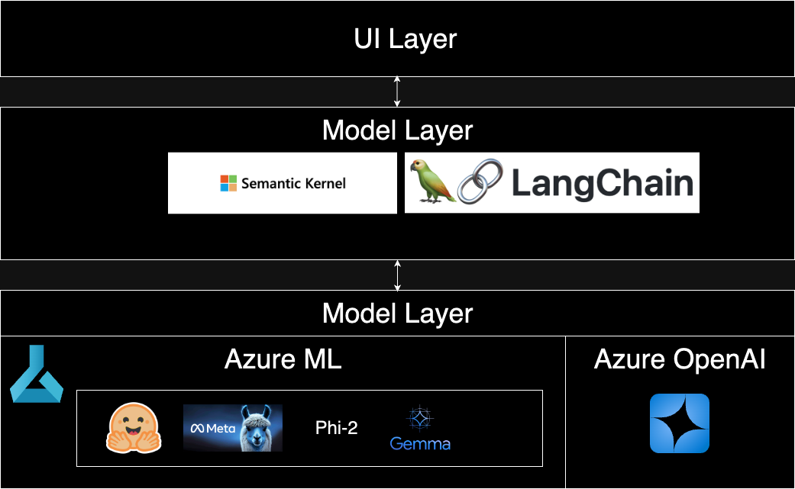

# Azure Custom LLMS OpenAI


This repository provides a simple deployment of any open-source model behind an OpenAI interface using Azure ML.

## Prerequisites

Make sure to have the Azure CLI (az cli) installed. If not, you can install it from here.
Remove the old Azure CLI ML extension with the following commands:

```bash
az extension remove -n azure-cli-ml
az extension remove -n ml
```

Add and update the Azure ML extension:

```bash
az extension add -n ml
az extension update -n ml
```

## Deployment

Note that deployment can take some time. Large model uploads can result in errors if the network connection is unstable.

To run the deployment:

```bash
./scripts/main.sh
```

## Inference

Set the environment variable in the .env file. You can refer to the .env.example file for an example.

Create a virtual environment and install the requirements:

```bash
python -m venv .venv
source .venv/bin/activate
pip install -r requirements.txt
```

Run the inference script:

```bash
python invoke_azureml.py
```
